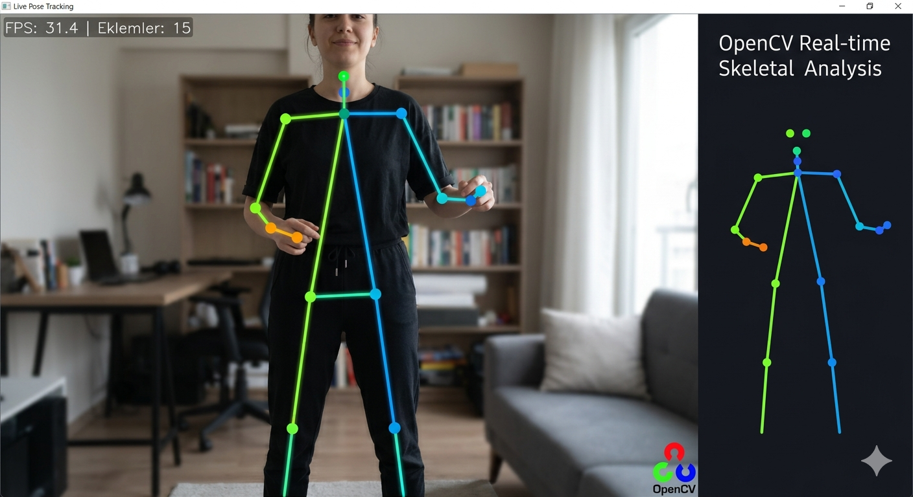

# Stable Pose Tracking

Stable Pose Tracking, webcam görüntüsünden insan vücudunu algılayarak **gerçek zamanlı iskelet (pose skeleton) çizimi** yapan basit bir Python projesidir.

Bu proje **MediaPipe Pose Landmarker** kullanarak insan vücudunun ana noktalarını tespit eder ve ekrana çizer.

---

## Demo

<p align="center">
  
</p>

---

## Özellikler

- 📷 Webcam üzerinden gerçek zamanlı insan algılama  
- 🦴 İnsan vücudu iskelet noktalarının çizimi  
- ⚡ Hızlı ve hafif çalışma  
- 🧠 MediaPipe Pose Landmarker kullanır  
- 💻 Basit ve anlaşılır Python kodu  

---

## Kurulum

Gerekli Python paketlerini yükleyin:

```bash
pip install -r requirements.txt
```

---

## Çalıştırma

Programı başlatmak için:

```bash
python main.py
```

---

## Kontroller

| Tuş | İşlev |
|-----|------|
| Q | Programdan çık |

---

## Notlar

- İlk çalıştırmada pose modeli otomatik olarak indirilir.
- Model `models/mediapipe/` klasörüne kaydedilir.
- Webcam açık olmalıdır.

---

## Kullanılan Teknolojiler

- Python
- OpenCV
- MediaPipe Tasks

---

## Lisans

Bu proje eğitim ve geliştirme amaçlı paylaşılmıştır.
